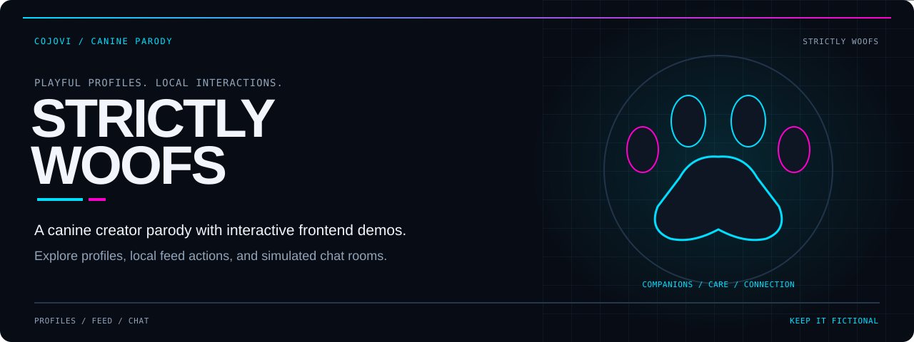
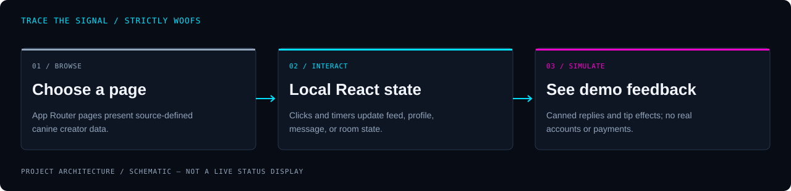

<!-- COJOVI / SIGNAL — Strictly_Woofs project edition. Keep readme-assets/ with this file. -->
<a name="top"></a>

<p align="center">
  
</p>

<h1 align="center">Strictly Woofs</h1>

<p align="center">
  <strong>Meet the creators. Explore the feed. Keep the transactions fictional.</strong><br>
  A canine-themed subscription-platform parody with interactive frontend demos.
</p>

<p align="center">
  
</p>

<p align="center">
  <a href="#overview">Overview</a> ·
  <a href="#architecture">Architecture</a> ·
  <a href="#quickstart">Quickstart</a> ·
  <a href="#configuration">Configuration</a> ·
  <a href="#validation">Validation</a> ·
  <a href="#security">Boundaries</a>
</p>

---

<a name="overview"></a>
## `> meet_the_pack`

**Strictly_Woofs is an interactive frontend parody, not a subscription service.** Its dark interface brings together a creator catalog, a feed, mock direct messages, and a simulated live room. The humor borrows subscription-platform conventions and includes suggestive copy.

This README describes **[cojovi/Strictly_Woofs](https://github.com/cojovi/Strictly_Woofs)** specifically. The similarly named `StrictlyWoofs.com` repository is a separate implementation; its commands and behavior are not interchangeable.

| Discover | Interact | Explore |
| :--- | :--- | :--- |
| Browse twelve source-defined creator profiles and their galleries. | Toggle feed likes and subscriptions; add comments and receive canned replies. | Open mock messages or a simulated live room with local chat and tip effects. |

> [!IMPORTANT]
> **Everything that looks like an account, payment, or conversation is a demo.** Login and signup navigate to the feed without authentication. Tips do not transfer money; subscriptions do not grant server-enforced access. Use only dummy input and do not present the interface as a working paid platform.

<a name="architecture"></a>
## `> trace_the_demo`

<p align="center">
  
</p>

```text
App Router pages + source-defined creator data
                    ↓
React state, timers, and UI components
                    ↓
Local feed / profile / message / live-room feedback
```

[Creator routes](src/app/creator/%5Busername%5D/page.tsx) generate parameters for twelve profiles, then pass data into [CreatorProfileClient.tsx](src/app/creator/%5Busername%5D/CreatorProfileClient.tsx). Feed, messaging, and live-room interactions use separate component state; they are not synchronized accounts or a shared store.

There are no tracked API routes, database adapters, payment handlers, or streaming transports. The live room displays a thumbnail image with simulated chat and viewer counts—not a video broadcast. State is not persisted across reloads.

[layout.tsx](src/app/layout.tsx) also loads a third-party `same-runtime` script. A frontend-only application is not necessarily an offline application: review that script and remote images before opening a copy.

<a name="quickstart"></a>
## `> open_the_workbench`

**Prerequisites:** Git, npm, and a Node.js release compatible with the locked dependencies. The locked Next.js package declares `^18.18.0 || ^19.8.0 || >=20.0.0`; the project itself does not pin a Node engine. Use a maintained compatible release rather than treating that minimum as a support recommendation.

### 1. Get this repository

```bash
git clone --branch main https://github.com/cojovi/Strictly_Woofs.git
cd Strictly_Woofs
```

### 2. Review the demo's external boundary

Inspect the runtime script in `src/app/layout.tsx`, remote image references, and the parody copy. Decide whether those resources and that audience fit your use. Do not enter real credentials into the demonstration forms.

No application environment variables or backend credentials are required by the reviewed source. Do not invent an `.env` file to make the simulated features work.

### 3. Install and preview on loopback

```bash
npm ci
npm exec -- next dev --hostname 127.0.0.1 --turbopack
```

Open **http://127.0.0.1:3000**, or the port reported by Next.js. This explicit invocation avoids the repository's `npm run dev` script, which binds to all interfaces with `-H 0.0.0.0`.

Both `package-lock.json` and `bun.lock` are tracked. The instructions above use the npm lockfile; do not casually mix dependency-resolution workflows.

<a name="usage"></a>
## `> try_the_interactions`

| Route | What to expect |
| :--- | :--- |
| `/` | Landing page, creator previews, and navigation into the demo. |
| `/feed` | Local likes, subscriptions, comments, generated notifications, and a tip dialog. |
| `/creator/[username]` | Profile, gallery/content tabs, and a local subscription toggle. |
| `/messages` | Fixture conversations, canned delayed replies, and simulated tips. |
| `/live` | Selectable mock rooms, thumbnail displays, generated chat, and viewer counters. |
| `/login` | Demonstration form with a delayed redirect to the feed. |
| `/signup` | Demonstration registration form with a delayed redirect to the feed. |

A profile's Message link passes a `creator` query parameter to the message page. Its conversation catalog is separate from the profile catalog: check that a selected creator is actually supported rather than assuming every profile has a matching thread.

Subscribe controls change local presentation. Profile overlays cover already-referenced images; they are **not content protection**. Some decorative controls and footer links remain placeholders.

<a name="configuration"></a>
## `> shape_the_parody`

| Change | Source of truth |
| :--- | :--- |
| Landing page and promotional copy | [src/app/page.tsx](src/app/page.tsx) |
| Profile data and generated routes | [Creator route](src/app/creator/%5Busername%5D/page.tsx) |
| Profile tabs and subscription display | [Profile client](src/app/creator/%5Busername%5D/CreatorProfileClient.tsx) |
| Feed fixtures and interaction handlers | [Feed page](src/app/feed/page.tsx) |
| Conversation catalog and canned responses | [Messages page](src/app/messages/page.tsx) |
| Mock stream list and chat timers | [Live page](src/app/live/page.tsx) |
| Shared logo and UI primitives | [src/components/](src/components/) |
| Styles and theme tokens | [globals.css](src/app/globals.css) and [tailwind.config.ts](tailwind.config.ts) |
| Runtime script and page metadata | [layout.tsx](src/app/layout.tsx) |

Keep duplicated creator identifiers, image paths, and display data aligned when editing. The profile route maintains both a data object and an explicit static-parameter list.

The npm package remains named `nextjs-shadcn`. The `@/*` alias points to `src/*`, and [tsconfig.json](tsconfig.json) selects `same-runtime/dist` as the JSX import source. Treat that as an integration decision, not unused branding.

<a name="validation"></a>
## `> check_the_demo`

These commands are available for a maintainer's controlled environment:

```bash
npm run build
npm run lint
```

`lint` invokes `bunx tsc --noEmit && next lint`, so it requires Bun even when dependencies were installed with npm. `format` also uses Bun and rewrites files. Neither command should be mistaken for a test suite.

**Application builds and tests were not run for this documentation work.** No test script or GitHub Actions workflow is tracked.

- [ ] Review suggestive copy and media rights for the intended audience.
- [ ] Review the external runtime script and remote image requests.
- [ ] Check every creator route and its matching message destination.
- [ ] Confirm that likes, tips, subscriptions, and replies are clearly labeled simulations.
- [ ] Check keyboard navigation, dialogs, form labels, and mobile layouts.
- [ ] Replace placeholder footer links and the unresolved `/placeholder-user.jpg` reference.
- [ ] Verify timer cleanup and random-render behavior during hydration.
- [ ] Reconcile deployment output and run build/lint in a controlled environment.

### Deployment is a separate decision

[next.config.js](next.config.js) sets `output: 'export'`, `distDir: 'out'`, and `trailingSlash: true`. [netlify.toml](netlify.toml), however, runs `bun run build` and publishes `.next`, while also setting `NETLIFY_NEXT_PLUGIN_SKIP` and declaring a Next.js plugin.

Those settings need reconciliation before deployment. Do not assume the tracked `next start` script serves a static export or that the Netlify publish directory matches the generated site. No deployment is performed by this README.

<a name="source-map"></a>
## `> explore_the_source`

| Path | Responsibility |
| :--- | :--- |
| [src/app/](src/app/) | Routes, shared layout, and client-side demos. |
| [ClientBody.tsx](src/app/ClientBody.tsx) | Client wrapper that resets the body class after hydration. |
| [src/components/ui/](src/components/ui/) | Local shadcn-style components built with Radix primitives. |
| [src/lib/utils.ts](src/lib/utils.ts) | Class-name composition helper. |
| [public/](public/) | Tracked media and logo files; review before reuse. |
| [package.json](package.json) | Next.js 15.3.8, React 18, dependencies, and scripts. |
| [eslint.config.mjs](eslint.config.mjs) / [biome.json](biome.json) | Lint and formatting policy, including relaxed accessibility rules. |

<a name="security"></a>
## `> keep_it_fictional`

- **No authentication or billing boundary exists.** Do not collect real passwords, payment details, or private conversations through this UI.
- **Local state is public presentation, not authorization.** Gating a card with an overlay does not protect its image or data.
- **Review third-party code before use.** The runtime script is loaded by the root layout; source review here does not establish what that remote code does.
- **Media suitability is not certified.** The source contains adult-platform parody and suggestive language. No claim is made that unseen media is family-friendly or cleared for redistribution.

### Attribution and license

Maintained in [cojovi/Strictly_Woofs](https://github.com/cojovi/Strictly_Woofs), with a create-next-app scaffold, shadcn-style components, Radix UI, and Same runtime integration. GitHub metadata does not identify this repository as a fork.

**No root license file was found in the reviewed revision.** Public availability is not a blanket reuse license. Clarify code and media permissions with their owners and preserve third-party notices.

---

<p align="center">
  
</p>

<p align="center">
  <strong>Playful profiles. Local interactions. Honest boundaries.</strong><br>
  <sub>A <a href="https://github.com/cojovi">Cody / cojovi</a> project · <a href="https://cojovi.com">cojovi.com</a><br>
  Strictly_Woofs · Presented in COJOVI / SIGNAL.</sub>
</p>

<p align="center"><a href="#top">↑ Back to the signal</a></p>
